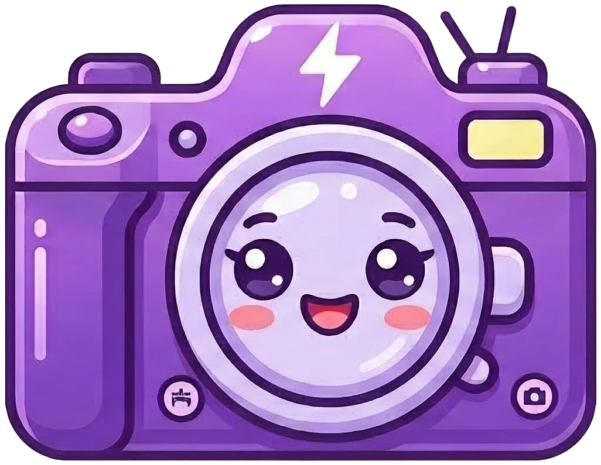
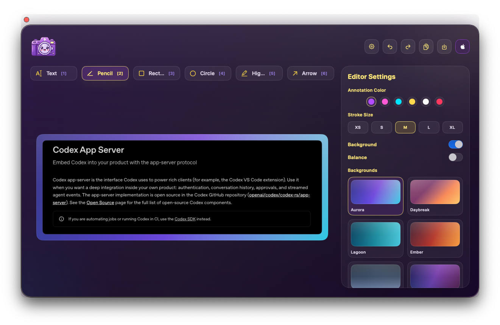

# Shotty

<p align="center">
  
</p>

Shotty is a native macOS screenshot tool for fast annotated captures. It lives in the menu bar, lets you grab a region with `Cmd + Shift + S`, mark it up in a floating editor, then copy or save a flattened PNG.



## Features

- Global `Cmd + Shift + S` capture shortcut
- Region selection across active displays
- Floating editor with text, pencil, rectangle, circle, highlight, and arrow tools
- Adjustable annotation colors and size presets
- Undo, redo, delete, copy, and save shortcuts
- Optional styled backgrounds with presets, padding, inset, corner radius, shadow, and auto-balance
- Menu bar controls for opening the editor, starting a capture, and quitting

## Requirements

- macOS 14 or newer
- Screen Recording permission for capture

## Install

Install Shotty into `/Applications`:

```bash
./scripts/install-app.sh
```

The script builds the app, creates the app bundle, installs it, and opens it. Shotty then runs as a menu bar utility without a Dock icon.

## Use Shotty

1. Launch Shotty and look for the camera icon in the menu bar.
2. Press `Cmd + Shift + S`, or choose `Capture Area` from the menu bar menu.
3. Drag to select a region. Press `Esc` to cancel.
4. Annotate the capture in the editor window.
5. Press `Cmd + C` to copy the current result or `Cmd + S` to save a PNG.

If Screen Recording permission has not been granted yet, Shotty will prompt for it when you try to capture. After granting access, trigger capture again.

## Editor Shortcuts

- `1`: Text
- `2`: Pencil
- `3`: Rectangle
- `4`: Circle
- `5`: Highlight
- `6`: Arrow
- `Delete`: Remove the selected annotation
- `Cmd + Z`: Undo
- `Shift + Cmd + Z`: Redo
- `Cmd + C`: Copy the current annotated image
- `Cmd + S`: Save the current annotated image as PNG
- `Esc`: Cancel capture, finish inline text editing, or close the editor depending on context

## Notes

- Copy and save export the flattened image, including annotations and appearance settings.
- The gear button opens the settings sidebar for annotation styling and background controls.
- The editor can be reopened at any time from the menu bar icon.
- `xcodebuild` is the supported CLI build path for this repo.
